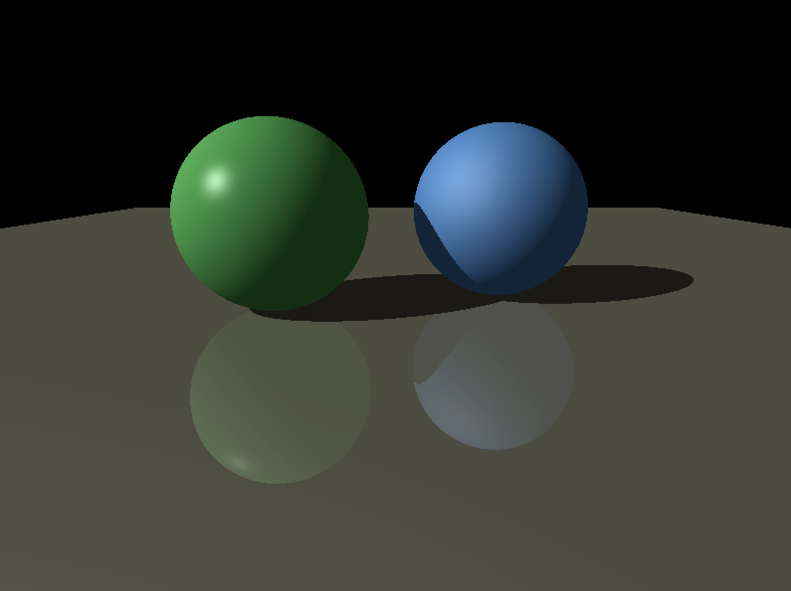

# simple-raytrace
A basic ray tracing implementation with shading, shadows, and reflections, based on the raytracer outlined 
in Chapter 4 of [Fundamentals of Computer Graphics](https://www.amazon.com/Fundamentals-Computer-Graphics-Fourth-Marschner/dp/1482229390/ref=pd_sbs_14_img_0?_encoding=UTF8&psc=1&refRID=GHEARH14T336MV9W8EBW).


Runs on Mac OS only for now.

### Example Renderings

#### _Twin Spheres_


#### _Floating Cube_


#### _The Great Pyramid_


### Compiling
[Rake](http://rake.rubyforge.org/) is used to build the program. Assuming you have Ruby and Rake installed:
```
[sinclairtarget 17:04 simple-raytrace]$ rake
mkdir -p build/SimpleRaytrace.app/Contents
cp Info.plist build/SimpleRaytrace.app/Contents/Info.plist
clang -fobjc-arc -c src/cocoa/ApplicationDelegate.m -o src/cocoa/ApplicationDelegate.o
clang -fobjc-arc -c src/cocoa/BitmapContentView.m -o src/cocoa/BitmapContentView.o
clang -fobjc-arc -c src/cocoa/BitmapWindow.m -o src/cocoa/BitmapWindow.o
clang -fobjc-arc -c src/cocoa/platform.m -o src/cocoa/platform.o
clang -c src/camera.c -o src/camera.o
clang -c src/color.c -o src/color.o
clang -c src/main.c -o src/main.o
clang -c src/random_sort.c -o src/random_sort.o
clang -c src/ray.c -o src/ray.o
clang -c src/ray_hit.c -o src/ray_hit.o
clang -c src/scene.c -o src/scene.o
clang -c src/shading.c -o src/shading.o
clang -c src/sphere.c -o src/sphere.o
clang -c src/triangle.c -o src/triangle.o
clang -c src/vec3.c -o src/vec3.o
mkdir -p build/SimpleRaytrace.app/Contents/MacOS
clang -framework Cocoa -o build/SimpleRaytrace.app/Contents/MacOS/SimpleRaytrace src/cocoa/ApplicationDelegate.o src/cocoa/BitmapContentView.o src/cocoa/BitmapWindow.o src/cocoa/platform.o src/camera.o src/color.o src/main.o src/random_sort.o src/ray.o src/ray_hit.o src/scene.o src/shading.o src/sphere.o src/triangle.o src/vec3.o
mkdir -p build/SimpleRaytrace.app/Contents/Resources
cp assets/skyrim.png assets/skyrim_man.png build/SimpleRaytrace.app/Contents/Resources
```

You can then run the program either by double-clicking on the created app or by using the `run.sh` script provided.

### Changing the Scene
The scene and the objects in it are hard-coded. See `BuildScene()` in [src/main.c](https://github.com/sinclairtarget/simple-raytrace/blob/master/src/main.c#L89). 
